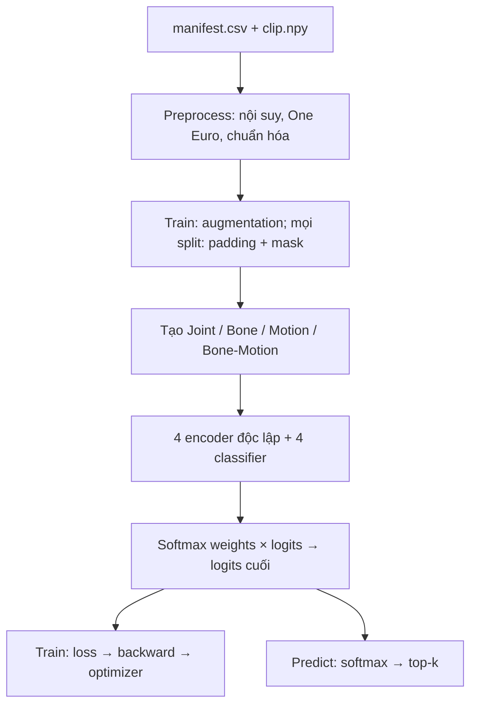

# HA-GCT — bản viết lại 4 stream, dễ đọc

Project nhận **skeleton 27 khớp**, phân loại **một ký hiệu trong một clip** bằng bốn stream **Joint, Bone, Motion, Bone-Motion**. Code và chú thích chia theo trách nhiệm để có thể lần từ dữ liệu đến dự đoán.

Đây là **bản triển khai lại theo hướng nhánh `hagct`**, không phải bản sao tương đương từng phép tính hoặc checkpoint cũ. Giữ bốn encoder độc lập, hai nhánh spatial/temporal trong mỗi encoder, gated fusion và learned logit fusion. Các thay đổi kiến trúc chủ động được ghi ở [05_CHANGES.md](docs/05_CHANGES.md). Chưa có kết quả benchmark dữ liệu thật; không mặc định các thay đổi sẽ tăng accuracy.

## 1. Chạy thử ngay, chưa cần dataset thật

Python 3.10+; môi trường đã kiểm thử: Python 3.12 và PyTorch 2.6 CPU. Mở terminal tại **thư mục chứa README này**.

```bash
python -m venv .venv
# Linux/macOS:
source .venv/bin/activate
# Windows PowerShell thay dòng trên bằng: .venv\Scripts\Activate.ps1

# Bản CPU để chạy thử:
pip install torch==2.6.0 --index-url https://download.pytorch.org/whl/cpu
pip install -r requirements.txt

python -m unittest discover -s tests -v
python -m scripts.smoke_test
```

`smoke_test` tự sinh dữ liệu giả, kiểm tra dữ liệu, in tensor shapes, train, resume, evaluate, predict, pretrain và fine-tune. Đầu ra nằm trong `runs/smoke/`. Chạy lần nữa phải dùng output khác, ví dụ `--output runs/smoke_02`, để không ghi đè kết quả cũ.

Muốn chạy **từng bước để hiểu**:

```bash
python -m scripts.make_demo_data
python -m scripts.check_data --config configs/demo.json
python -m scripts.trace_flow --config configs/demo.json
python train.py --config configs/demo.json --threads 1
python evaluate.py --checkpoint runs/demo/best.pt --split test --output runs/demo_eval --threads 1
python predict.py --checkpoint runs/demo/best.pt --input data/demo/samples/test_0_0.npy --classes data/demo/classes.json --threads 1
```

`demo` chỉ có 3 lớp giả, 27 mẫu và model nhỏ. Accuracy của demo không có ý nghĩa nghiên cứu.

## 2. Nắm luồng chạy trong một phút



Trong **mỗi** encoder: embedding tách thành **HA-GC không gian** và **MHSA thời gian**; hai nhánh được kết hợp bằng **gated fusion**. Vì vậy **4 stream ≠ 2 nhánh S/T**.

| Bạn muốn hiểu gì? | Đọc file | Điểm bắt đầu |
|---|---|---|
| Lệnh train gọi những gì? | `hagct/engine/trainer.py` | `main()` → `train()` → `run_epoch()` |
| Một sample được đọc thế nào? | `hagct/data/dataset.py` | `SkeletonDataset.__getitem__()` |
| Xử lý tọa độ / mask ở đâu? | `hagct/data/preprocess.py`, `augment.py` | `preprocess()` → `augment_and_pad()` |
| Bốn stream được sinh và ghép ra sao? | `hagct/models/four_stream.py` | `build_streams()`, `FourStreamHAGCT.forward()` |
| Một encoder làm gì? | `hagct/models/encoder.py`, `blocks.py` | `HAGCTEncoder.forward()` |
| Pretrain rồi nạp trọng số thế nào? | `hagct/models/pretrain.py`, `engine/trainer.py` | `MaskedReconstruction`, `initialize_encoders()` |
| Checkpoint dùng để dự đoán thế nào? | `hagct/engine/inference.py` | `load_model()`, `predict_main()` |

Chạy `python -m scripts.trace_flow --config configs/demo.json` để xem **shape thật tại từng bước**, không cần tự đặt breakpoint.

## 3. Cấu trúc thư mục

| Đường dẫn | Trách nhiệm |
|---|---|
| `train.py`, `pretrain.py`, `evaluate.py`, `predict.py` | Bốn điểm vào ngắn, chỉ chuyển đến logic tương ứng |
| `hagct/config.py` | Dataclass + đọc/kiểm tra JSON; không phụ thuộc YAML |
| `hagct/topology.py` | Một nguồn chuẩn cho thứ tự joint, parent, adjacency |
| `hagct/data/` | Đọc manifest, preprocessing, One Euro, augmentation |
| `hagct/models/` | Các block, encoder, classifier, four-stream, reconstruction |
| `hagct/engine/` | Optimizer/scheduler, train, metrics, checkpoint, inference |
| `configs/` | Demo, template MultiVSL200, template VSL400 |
| `scripts/` | Chuẩn bị dữ liệu, kiểm tra dữ liệu, trace luồng, smoke test |
| `tests/` | Unit tests và integration tests CPU |
| `docs/` | Hướng dẫn theo chủ đề, bảng thay đổi, báo cáo kiểm thử |
| `data/`, `runs/` | Được sinh khi chạy; không đóng kèm dataset/checkpoint |

## 4. Train dữ liệu thật

1. Chuẩn bị skeleton **đúng thứ tự 27 joint**, một file `.npy` mỗi clip; xem [dữ liệu](docs/02_DATA.md).
2. Tạo `manifest.csv`: `path,label,split` và `signer` nếu đánh giá cross-signer. Giữ protocol đánh giá đã thống nhất; **không tự chia lại test để tăng điểm**.
3. Sao chép config phù hợp, sửa `manifest`, `layout`, `channels`, `num_classes`, `max_frames`, `output_dir`. `199` và `400` trong template phải được đối chiếu với dataset của bạn.
4. Chạy kiểm tra rồi train:

```bash
python -m scripts.check_data --config configs/multivsl200.json --check-duplicates
python train.py --config configs/multivsl200.json
python evaluate.py --checkpoint runs/multivsl_baseline/best.pt --split test --output runs/multivsl_test
```

### Chạy thử bằng `27kpt.zip` trong thư mục Drive được chia sẻ

Gói này đã chứa skeleton `(150,27,3)` và `labels.csv`, vì vậy không cần trích xuất lại từ video. Đặt file ZIP ở đâu cũng được rồi chạy từ project root:

```powershell
python -m scripts.prepare_27kpt_zip --archive "D:\DuongDan\27kpt.zip" --output data/trial_27kpt --num-classes 10
python -m scripts.check_data --config data/trial_27kpt/trial_config.json
python train.py --config data/trial_27kpt/trial_config.json --threads 1
```

Đây là trial 10 lớp, model nhỏ, 2 epoch để kiểm tra pipeline. Khi trial chạy xong mới chuẩn bị cả 199 lớp bằng `--num-classes 199` và dùng cấu hình nghiên cứu lớn hơn. Channel thứ ba của gói là Z nên config sinh ra dùng `channels=xyz`; model 2D lấy X,Y.

GPU: cài PyTorch CUDA phù hợp từ [hướng dẫn chính thức](https://pytorch.org/get-started/locally/) thay bản CPU. `device=auto` chọn CUDA nếu khả dụng; AMP chỉ bật trên CUDA. Bốn encoder tốn bộ nhớ hơn một encoder: nếu OOM, giảm `batch_size`, tăng `accum_steps` để gần giữ effective batch size.

## 5. Pretrain tùy chọn và resume

Không bắt buộc pretrain để chạy supervised baseline. Bắt đầu từ baseline trước để biết pretrain có ích trên protocol của bạn hay không.

```bash
python pretrain.py --config configs/multivsl200.json --output runs/multivsl_pretrain --epochs 50 --mask-ratio 0.3
python train.py --config configs/multivsl200.json --output runs/multivsl_finetune --pretrained runs/multivsl_pretrain/best.pt

# Tiếp tục run bị ngắt ở checkpoint epoch gần nhất:
python train.py --config configs/multivsl200.json --resume runs/multivsl_baseline/last.pt
```

Pretrain chỉ update từ **train**, validation dùng chọn checkpoint; **test không tham gia tối ưu hay chọn checkpoint**. Encoder pretrained nạp vào **cả bốn stream**, mỗi stream vẫn có tham số riêng sau khi nạp. Không bảo đảm encoder học Joint luôn hữu ích cho Bone/Motion — cần ablation.

`--resume` khôi phục model, optimizer, scheduler, scaler, RNG và early-stopping counter. Giữ nguyên config/lịch tổng epochs, chạy trong output dir cũ; không phải cơ chế nạp checkpoint tùy ý. Xem [training](docs/04_TRAINING.md).

## 6. Đọc tiếp theo thứ tự

1. [01_FLOW — một batch đi qua toàn hệ thống](docs/01_FLOW.md)
2. [02_DATA — format, topology, split và chuyển dataset](docs/02_DATA.md)
3. [03_MODEL — công thức bốn stream và mỗi encoder](docs/03_MODEL.md)
4. [04_TRAINING — loss, optimizer, resume, output](docs/04_TRAINING.md)
5. [05_CHANGES — giữ gì, sửa gì, chưa triển khai gì](docs/05_CHANGES.md)
6. [06_KAGGLE — cách chạy notebook/Kaggle và lỗi thường gặp](docs/06_KAGGLE.md)
7. [TEST_REPORT — phạm vi kiểm thử và giới hạn](docs/TEST_REPORT.md)

Nguồn tham khảo và phạm vi tái sử dụng: [ATTRIBUTION.md](ATTRIBUTION.md). Bản này **không bao gồm** STGAIN/Diffusion, bidirectional Cross-Attention, video-to-skeleton, continuous sign-language recognition, hay trọng số đã train trên dữ liệu thật.
