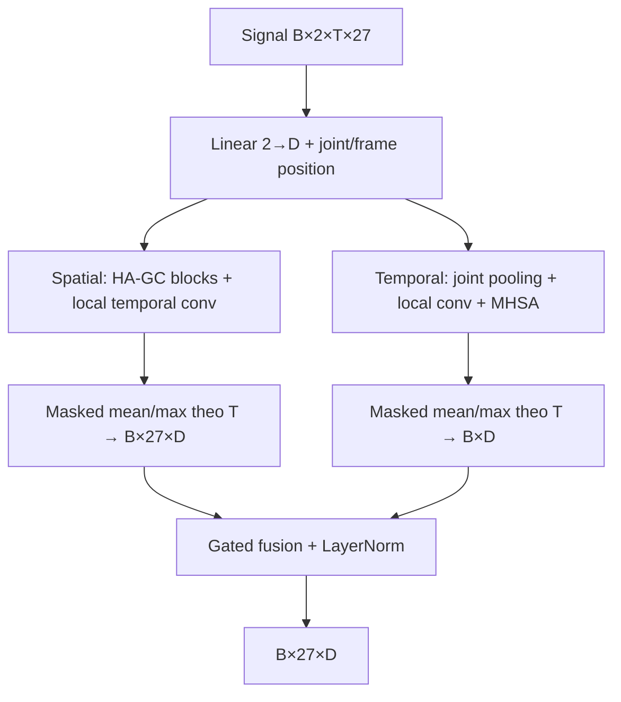

# 03 — Bốn stream và encoder HA-GCT

Ký hiệu: `B` batch, `T` frame, `V=27` khớp, `C=2` tọa độ, `D` hidden dimension, `K` lớp.

## 1. Bốn tín hiệu đầu vào

Với `J[t,v]` là joint sau preprocessing/augmentation và `p(v)` là parent:

| Stream | Công thức | Ý nghĩa |
|---|---|---|
| Joint | `J[t,v]` | Vị trí tương đối |
| Bone | `J[t,v] - J[t,p(v)]` | Hướng và độ dài xương |
| Motion | `J[t,v] - J[t-1,v]` | Thay đổi vị trí qua một frame |
| Bone-Motion | `B[t,v] - B[t-1,v]` | Thay đổi vector xương |

Đây là sai phân theo **frame**, không chia `dt` để thành vận tốc vật lý. Root bone bằng 0. Motion ở frame đầu và mọi cặp mà một frame là padding đều bằng 0. Frame đầu một clip đặt giữa padding cũng bằng 0; không tạo cú nhảy từ padding vào clip.

Bốn encoder có cấu trúc giống nhau nhưng **không share parameters**. Các stream đều dùng frame mask của clip gốc, kể cả frame motion đầu bằng 0 vẫn là frame thuộc clip.

## 2. Một encoder

### Embedding

Tọa độ `(B,T,V,2)` qua Linear thành `(B,T,V,D)`. Cộng learned joint position và frame position. Mask bị áp lại sau embedding để bias/position không biến padding thành feature thật. Frame position tính theo index sau placement, nên dịch clip trong train là một augmentation; **không tuyên bố bất biến với việc dịch vị trí**.

### Nhánh không gian S

Mỗi `SpatialBlock` có graph toàn skeleton và graph tăng chú trọng bàn tay. Mỗi graph gồm ba subset: self, inward, outward. Hand graph thêm cạnh nối hai lòng bàn tay 7–17; cả hai graph đều giữ self links.

`AdaptiveGraphConv` học trọng số dương qua softplus **chỉ trên cạnh support đã có**, rồi chuẩn hóa theo chiều source cho từng destination. Tín hiệu từng subset được projection riêng, graph aggregate, lấy trung bình ba subset. Khi một destination không có cạnh trong subset, phần đóng góp subset đó là 0.

Một scalar sigmoid gate trộn body/hand graph trong mỗi block; đây **không phải attention phụ thuộc từng sample**. Sau GELU/Linear/Dropout, cộng residual qua DropPath và áp mask. Sau các block, depthwise convolution kernel 3 chạy theo thời gian **riêng cho mỗi joint**. Masked mean+max theo T, Linear `2D→D`, được `(B,V,D)`.

### Nhánh thời gian T

MLP chấm điểm mỗi joint, softmax theo V, weighted sum tạo `(B,T,D)`. Depthwise Conv1D kernel 3 học chuyển động cục bộ. Các `TemporalBlock` dùng multi-head self-attention trên **T frame** và FFN `D→4D→D`.

Key padding mask chặn padded keys; output padded queries được xóa sau residual. FFN chỉ trả transform và được cộng residual một lần. Không lấy adjacency `(27,27)` cộng vào attention `(T,T)`: chúng thuộc **hai trục khác nhau**.

Sau masked mean+max theo T và Linear `2D→D`, feature `(B,D)` được broadcast thành `(B,V,D)` để kết hợp với nhánh S.

### Gated fusion S/T

`g = sigmoid(Linear(concat(S,T)))`, `F = LayerNorm(g*S + (1-g)*T)`.

Gate thay đổi theo sample, joint và feature. Đây là **gated fusion**, không có query S/key T hay query T/key S. Bidirectional Cross-Attention trong hướng nghiên cứu chưa triển khai trong bản này.

## 3. Classifier và fusion giữa bốn stream

Với feature `(B,V,D)`, classifier ghép mean/max theo V → LayerNorm → Linear `2D→D` → GELU → Dropout → Linear `D→K`.

Cho logits `z_s` từ bốn classifier và tham số học được `a∈R⁴`:

`w = softmax(a)` và `z_final = Σ_s w_s * z_s`.

`a` ban đầu bằng 0 nên `w=(0.25,0.25,0.25,0.25)`. Đây là **bốn trọng số toàn cục**, không phụ thuộc sample hoặc class. Không concat feature bốn stream và không trung bình xác suất sau softmax. Gradient từ loss logits cuối chảy về cả bốn encoder và fusion weights; không có auxiliary loss riêng từng stream.

## 4. Pretrain masked reconstruction

`MaskedReconstruction` có **một encoder** và decoder MLP. Chọn khoảng `mask_ratio×27` joint cho mỗi sample, che toàn bộ quỹ đạo joint đó bằng learned mask token sau input projection; **vẫn cộng positional embedding**.

Encoder trả `(B,V,D)` đã pool theo thời gian. Decoder `D→2D→2*Tmax` tái tạo XY của cả quỹ đạo mỗi joint, rồi reshape về `(B,2,Tmax,V)`. Đây là bottleneck temporal pooled đơn giản, không phải decoder transformer giữ token từng frame hay mô hình diffusion.

MSE chỉ tính trên joint đã che và frame hợp lệ; normalize theo số tọa độ được chọn của mỗi sample, rồi lấy mean theo sample. Train augmentation vẫn crop/speed/rotate/bone-scale/noise nhưng tắt joint-zero masking để không làm mất target trước reconstruction. Val không augmentation và dùng mask sampling seed cố định qua các epoch.

Khi fine-tune: bỏ decoder, nạp encoder cùng shape/kiến trúc vào cả Joint/Bone/Motion/Bone-Motion; khởi tạo mới bốn classifier và fusion weights. Các encoder sau đó học độc lập. Encoder pretrained không nhất thiết giúp mọi loại tín hiệu — cần kiểm chứng.

## 5. Lựa chọn triển khai cần biết

- LayerNorm thay BatchNorm: không trộn thống kê padded frame vào valid frame; làm thay đổi mô hình so với code cũ.
- Softplus + support graph: học edge strength trên topology có sẵn; không có dynamic dense adjacency phụ thuộc sample.
- Giữ một kích thước D qua các block; không mô phỏng toàn bộ tùy chọn channel schedule của repo cũ.
- Temporal conv depthwise + Linear/GELU; không cam kết giống số lớp/khởi tạo/scale của implementation cũ.
- Preprocessing root-relative + scale vai là baseline lựa chọn lại; có thể tắt scale bằng config.
- Model chỉ nhận một người và một ký hiệu đã cắt clip. Không tự phát hiện ranh giới ký hiệu từ video dài.

Xem bảng đối chiếu ở [05_CHANGES](05_CHANGES.md) trước khi gọi bản này là reproduction của một paper.
